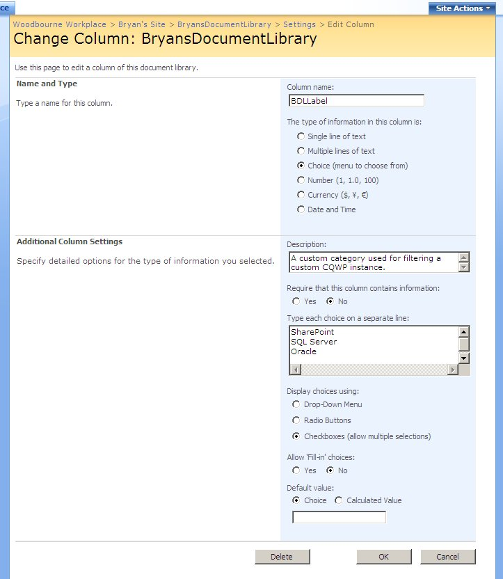
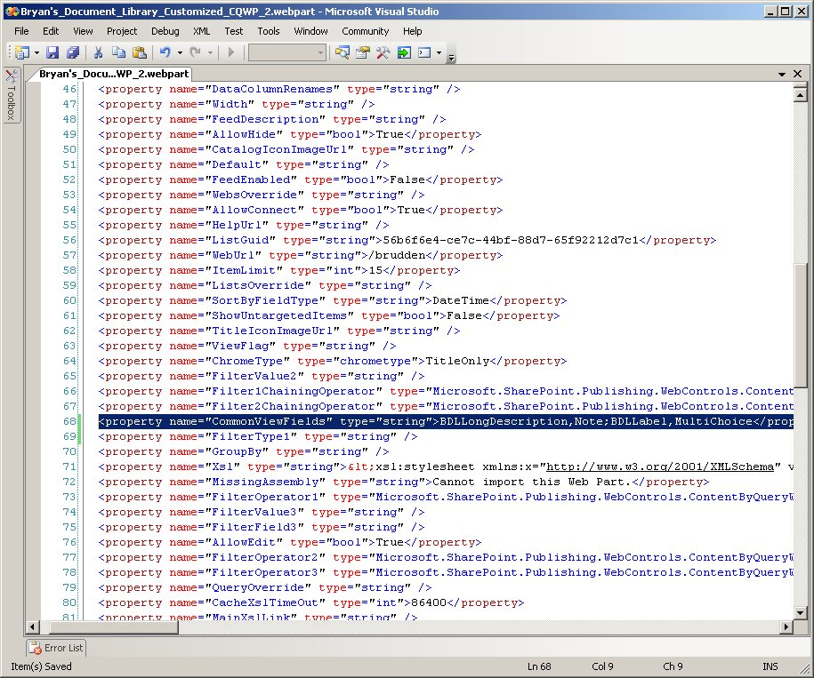
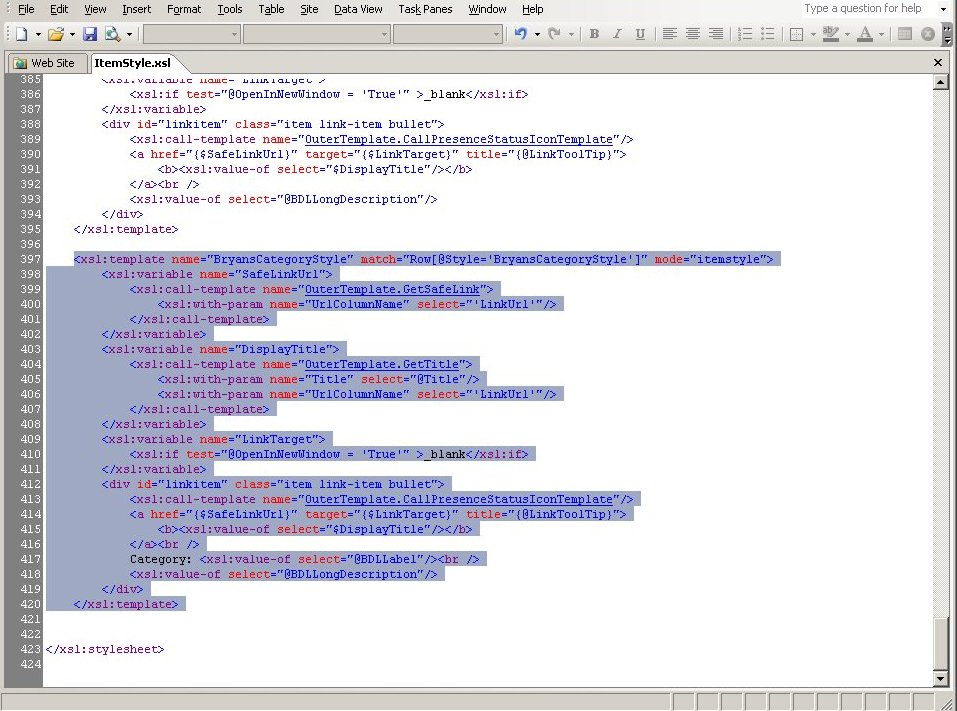
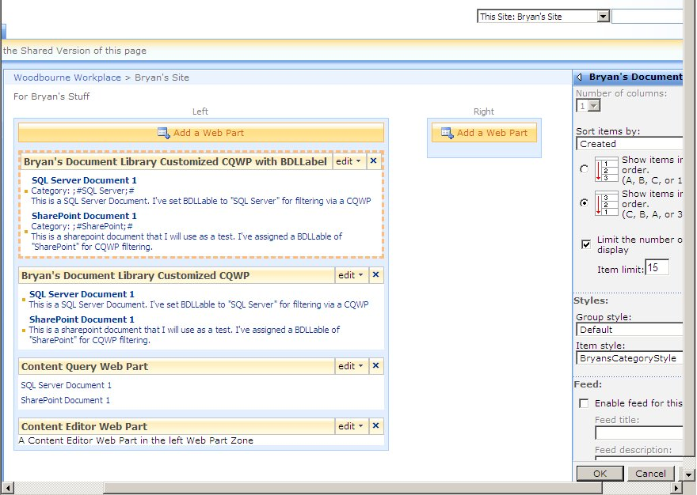
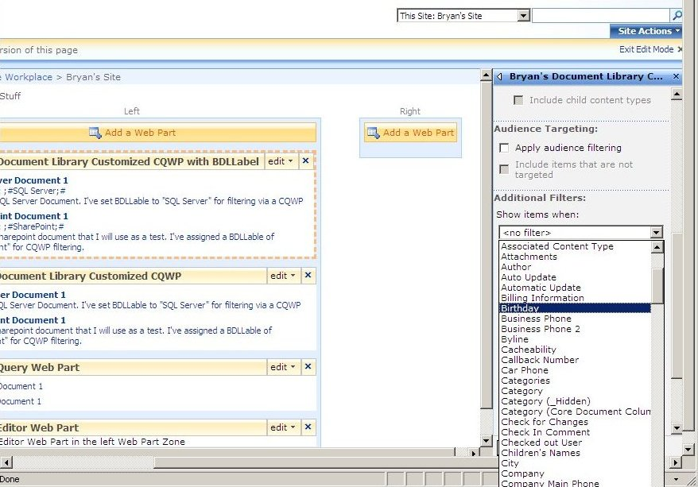

> We'll be working off of the example site, list, columns and CQWP used in the post [Walkthough Customizing a CQWP Instance](/share-point-moss-2007-walkthough-customizing-a-cqwp-instance)

In our last exercise we created a new team site, created a custom list and added a few custom columns to the list.  We added a text field called BDLLongDescription, and displayed its value as part of the results of a custom CQWP.  Now we'll look at the other column we created, which happens to be a special beast in MOSS: the MultiChoice column.

Lets start by saying, avoid using a MultiChoice column type for display.  Think of this column type as something more used more for filtering and sorting, it works great for that. For display, the out of the box format for the MultiChoice column looks horrible...but its still readable, and useful for debugging.  Lets check it out.

your custom column should look like the above.  Check it in the list settings to verify.

Next, export the CQWP as we did in the last example.  Modify the CommonViewFields to look like the screen below.

Import that guy, then edit the ItemStyle.xsl again, as we did in the last exercise.  Make a copy of BryansStyle and name it `BryansCategoryStyle` then add the line that references BDLLabel shown below. 

Modify the web part, and under properties, select the new style `BryansCategoryStyle` and click apply.

Crazy!  Out of the box, you get access to that field but it doesnt display as you would expect.  The values are delimited by pound signs and simicolons ... argh! And though I'm sure there is an XML function we could write to rid us of that goo, its easier to simply avoid using this column type for anything other than just filtering and sorting.  You can, however, use the single select column for display, it works just fine out of the box.  In the .webpart file, that column type is considered a `Choice` type, rather than the `MultiChoice` type we used here.

Now that we know to avoid using the MultiChoice column for display, lets try to filter using that column.  Modify the web part on our default page, then under the query section scroll down to `Additional Filters` and look for our new column...

...where the heck is it?! Well, look in the above section in the filter called `Content type`.  Change those values around and then look at what becomes available in the `Addition Filters` section.  Thats right, the list of metadata used for filtering is drawn from `Content Types`.  When I had you setup your custom columns, we didnt create a new content type for them.  We skipped around that part to add our columns directly to a list, which as you can see ends up limiting the usefulness of columns when they are not assigned to a content type.

The next article will talk about content types in more detail. We'll setup a content type for our data, assign it to a custom list, then do some proper filtering using the CQWP.
