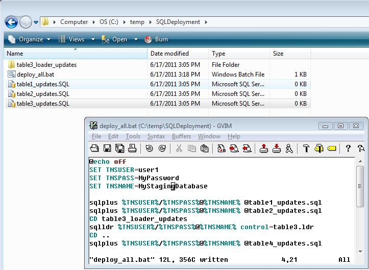

So in a recent project, I ended up scripting out database changes (data only, no schema changes) from our dev environment to all our other environments for one of our projects.  This is a incremental update, so I want to append my new data to any existing data for the tables I'm working with.

Without CLOB column types, it would be pretty easy - I could create some pretty standard SQL scripts to run in SQLPlus or SQL Developer on the target database. But this time we had change to CLOB data - some of the data being inserted being over 10,000 characters long. It took me a while to figure out how to make a deployment package, and this is what I came up with: 

- A set of standard SQL scripts for tables that do not have CLOB columns
- Oracle sqlldr scripts for CLOB columns

Both those things I usually do via the "unload" command in SQL Developer, so I started with the format SQL developer uses and modified the results to get my final deployment package.

**Solving the CLOB problem!**
Keep in mind, this may not be the best way to do it (I hope it isnt, cause its painful!) but this was the best reliable way I could find to do the task without writing a custom application to do it.

So in this case I am stuck using sqlldr to load CLOB data, which unfortunately requires that we have the oracle client installed AND configured to use TNS Names properly. I find that to be a pain, but whatever - it is doable.  Just be sure to use the same oracle client version as your target server oracle version (I ran into the problem of trying to use oracle 10 client tools to import data into oracle 11 - errors everywhere!).

**Creating The Deployment Package!**
Once I had all the Oracle client tools installed and configured properly, I ran through a process that looked something like the following to build a deployment package.

1. Create SQL scripts for non CLOB tables (used SQL Developer to unload query results). Keep in mind to order the script to run in a way that will work with constraints enabled (I chose not to disable constraints during deployment)
1. Edit SQL scripts generated in last step. Add "COMMIT;" then "EXIT;" commands at the end of the files in prep for running from the command line.
1. Create oracle Loader scripts for CLOB tables (again used SQL Developer to unload query results). Again, keep in mind the order in which the loader scripts need to be run along with the SQL scripts created earlier.
1. Edit Loader control files to APPEND (rather than truncate, so in this case I don't loose existing data in my destination) and fixed table names to be proper case.  Each Loader results set went into its own directory.
1. Placed all SQL scripts in a deploy directory, added loader directories as sub directories.
1. Finally, I ended up creating a .bat script to run -all- the deployment scripts, including the SQL scripts. In my case, I need to edit the .bat file to set TNS Names info for whatever environment I want to deploy to.

My final database deployment package for this release looks something like this:

From here, I can then edit one .bat file to change my destination database settings, and I only need to execute that file to perform the DB deployment.

Going through this process is a lot of extra up front work but it should result in a much more simplified, repeatable and reliable deployment process.
