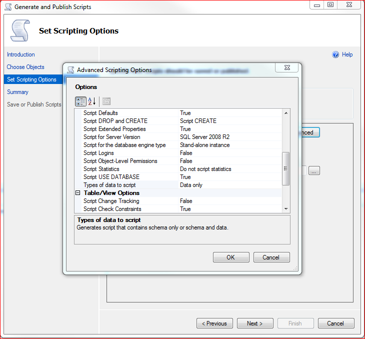

Another quirk of Microsoft SQL Server Management Studio 2008 - they made the option to export table data as SQL insert statements almost impossible to find.  Here's how you do it:  

1. Right click on the database and go to Tasks -> Generate Scripts
1. Select the tables that you want to generate the script for
1. Go to Set scripting options and click the Advanced button
1. In the General category, go to type of data to script
1. There are 3 options: Schema Only, Data Only, and Schema and Data. Select the appropriate option and click on OK

Found that gem <a href="http://stackoverflow.com/questions/982568/what-is-the-best-way-to-auto-generate-insert-statements-for-a-sql-server-table">here</a>.
